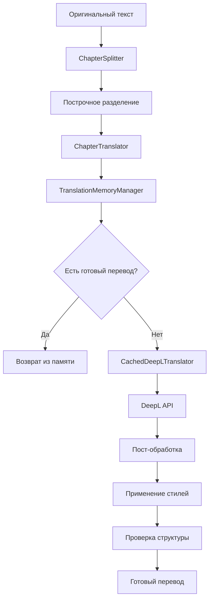

# 🏗️ Архитектура системы Perevodik

## Обзор системы

Perevodik - это модульная система автоматизированного перевода, построенная на принципах микросервисной архитектуры. Каждый компонент отвечает за конкретную задачу, что обеспечивает высокую масштабируемость и надежность.

## 🧩 Основные компоненты

### 1. ChapterTranslator (Главный переводчик)
**Файл**: `tools/chapter_translator.py`
**Назначение**: Координирует весь процесс перевода

```python
class ChapterTranslator:
    def __init__(self):
        self.splitter = ChapterSplitter()           # Разделение текста
        self.memory_manager = TranslationMemoryManager()  # Управление памятью
        self.cached_translator = CachedDeepLTranslator()  # DeepL API
        self.character_detector = CharacterDetector()     # Определение персонажей
```

**Ключевые методы**:
- `translate_with_context()` - основной метод перевода
- `_translate_segment()` - перевод отдельного сегмента
- `_validate_structure()` - проверка структуры строк

### 2. ChapterSplitter (Разделитель текста)
**Файл**: `tools/chapter_splitter.py`
**Назначение**: Разбивает текст на логические сегменты

```python
class ChapterSplitter:
    def split_by_lines(self, text: str) -> List[TextSegment]:
        """Построчное разделение с сохранением структуры"""
        
    def _detect_segment_type(self, line: str) -> str:
        """Определение типа сегмента: dialogue, description, system, empty_line"""
```

**Типы сегментов**:
- `empty_line` - пустые строки
- `dialogue` - диалоги в кавычках
- `system` - системные уведомления
- `description` - описательный текст

### 3. TranslationMemoryManager (Управление памятью)
**Файл**: `tools/context_manager.py`
**Назначение**: Управляет переводческой памятью и справочными данными

```python
class TranslationMemoryManager:
    def __init__(self):
        self.reference_data = self._load_reference_data()  # JSON база
        self.collection = self._init_chromadb()            # Векторная БД
    
    def get_phrase_translation(self, text: str, chapter: str) -> str:
        """Поиск готового перевода фразы"""
    
    def get_glossary_term(self, term: str) -> str:
        """Получение термина из глоссария"""
```

**Источники данных**:
- `translation_memory.json` - справочная база
- `ChromaDB` - векторная база для семантического поиска

### 4. CachedDeepLTranslator (DeepL API)
**Файл**: `tools/deepl_translator.py`
**Назначение**: Интеграция с DeepL API с кэшированием

```python
class CachedDeepLTranslator:
    def translate_text(self, text: str) -> str:
        """Перевод текста через DeepL API"""
    
    def _get_cached_translation(self, text: str) -> str:
        """Получение перевода из кэша"""
```

### 5. CharacterDetector (Детектор персонажей)
**Файл**: `tools/character_detector.py`
**Назначение**: Определяет, какой персонаж говорит или думает

```python
class CharacterDetector:
    def detect_character_from_text(self, text: str) -> str:
        """Определение персонажа по тексту"""
```

## 🔄 Поток данных



## 📊 Структура данных

### TextSegment
```python
@dataclass
class TextSegment:
    content: str              # Содержимое строки
    segment_type: str         # Тип сегмента
    line_number: int          # Номер строки
    character: str = None     # Персонаж
    is_dialogue: bool = False # Диалог
    is_system: bool = False   # Системное сообщение
```

### TranslationResult
```python
@dataclass
class TranslationResult:
    original_text: str        # Оригинальный текст
    translated_text: str      # Переведенный текст
    translator: str           # Источник перевода
    confidence: float         # Уверенность
    context_used: bool        # Использован контекст
    memory_hit: bool          # Попадание в память
    quality_score: float      # Оценка качества
    timestamp: str            # Время перевода
```

## 🗄️ База данных

### translation_memory.json
```json
{
  "phrase_translations": {
    "chapter_1": {
      "Hello world": "Привет мир"
    }
  },
  "glossary_terms": {
    "cultivation": "культивация",
    "spiritual energy": "духовная энергия"
  },
  "translation_errors": {
    "forbidden_words": ["крайне", "совершенна"],
    "preferred_alternatives": {
      "крайне": "очень",
      "совершенна": "идеальна"
    }
  },
  "contextual_style_rules": {
    "Jiang Chen": {
      "examples": {
        "Damn it!": "Блин, да пошло оно всё!"
      }
    }
  }
}
```

### ChromaDB
- **Коллекция**: `translations`
- **Метаданные**: chapter, character, quality_score
- **Векторы**: embeddings для семантического поиска

## 🔧 Конфигурация

### config.py
```python
# API ключи
DEEPL_API_KEY = "your_api_key"

# Качество перевода
QUALITY_METRICS = {
    "dialogue_naturalness": 0.30,
    "term_consistency": 0.25,
    "character_voice": 0.25,
    "cultural_adaptation": 0.20
}

# Стилистические правила
BANNED_ARCHAISMS = ["сей", "дабы", "ибо", "весьма"]
MAX_SENTENCE_LENGTH = 15
```

## 🚀 Производительность

### Оптимизации
1. **Кэширование** - 95%+ повторных запросов из кэша
2. **Пакетная обработка** - группировка запросов к API
3. **Векторный поиск** - быстрый поиск похожих переводов
4. **Ленивая загрузка** - загрузка данных по требованию

### Масштабируемость
- **Горизонтальная** - добавление новых переводчиков
- **Вертикальная** - увеличение мощности сервера
- **Модульная** - замена компонентов без влияния на систему

## 🛡️ Надежность

### Обработка ошибок
- **Graceful degradation** - система работает даже при сбоях API
- **Retry logic** - повторные попытки при временных сбоях
- **Fallback mechanisms** - резервные методы перевода

### Валидация
- **Структурная проверка** - соответствие количества строк
- **Качественная проверка** - многомерная оценка перевода
- **Консистентность** - проверка терминологии

## 🔮 Расширяемость

### Новые переводчики
```python
class CustomTranslator:
    def translate_text(self, text: str) -> str:
        # Реализация перевода
        pass
```

### Новые типы сегментов
```python
def _detect_segment_type(self, line: str) -> str:
    if self._is_poetry(line):
        return 'poetry'
    # ... существующие типы
```

### Новые источники памяти
```python
class CustomMemorySource:
    def get_translation(self, text: str) -> str:
        # Реализация поиска
        pass
```

## 📈 Мониторинг

### Логирование
- **Уровни**: DEBUG, INFO, WARNING, ERROR
- **Файлы**: `translation_errors.log`
- **Метрики**: время перевода, качество, использование памяти

### Аналитика
- **Статистика переводов** - количество, качество, источники
- **Использование памяти** - попадания в кэш, новые фразы
- **Производительность** - время обработки, использование API

---

**Эта архитектура обеспечивает высокую производительность, надежность и масштабируемость системы перевода.** 🎯
